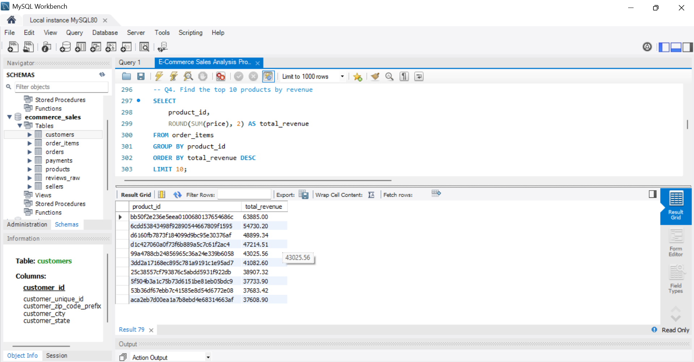
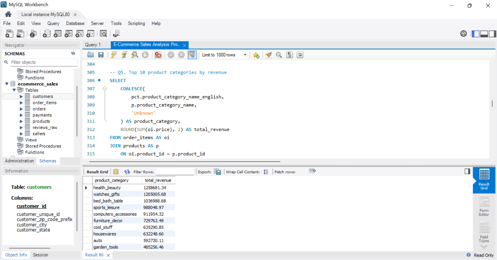
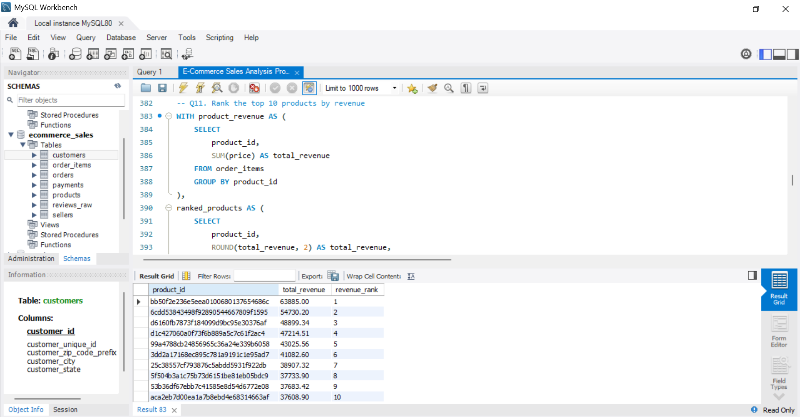
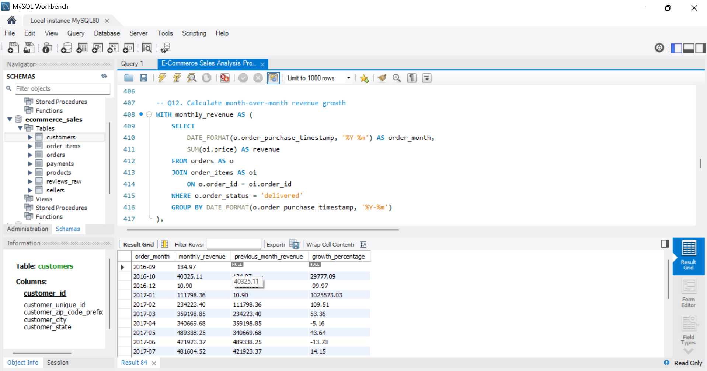
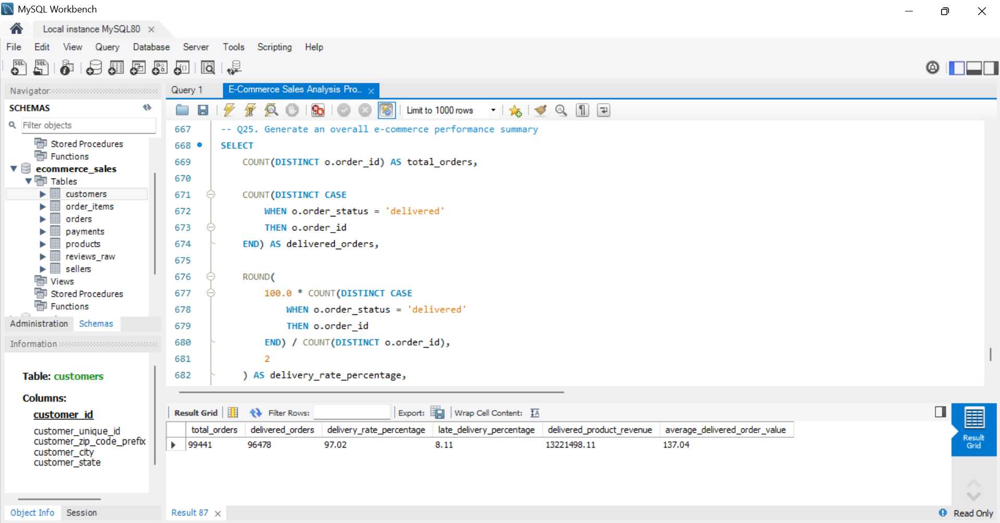

# Olist E-Commerce Sales Analysis Using MySQL

## Project Overview

Analyzed the Olist Brazilian E-Commerce dataset using MySQL to identify sales trends, customer purchasing behavior, product performance, payment patterns, and delivery performance.

## Project Objectives

* Analyze total revenue and average order value.
* Identify top-performing products and product categories.
* Understand customer purchasing behavior and repeat purchases.
* Analyze sales performance by state.
* Evaluate payment methods and order statuses.
* Investigate late deliveries and customer review scores.

## Tools and Technologies

* **Database:** MySQL 8.0
* **SQL Client:** MySQL Workbench
* **Dataset:** Olist Brazilian E-Commerce Public Dataset

## SQL Skills Demonstrated

* SELECT, WHERE, ORDER BY, LIMIT
* Aggregate functions: SUM, COUNT, AVG, ROUND
* GROUP BY and HAVING
* INNER JOIN and LEFT JOIN
* Subqueries and Common Table Expressions (CTEs)
* Window functions: RANK() and LAG()
* Date functions and conditional logic
* CASE statements and NULL handling

## Key Findings

* **Total orders:** 99,441
* **Delivered orders:** 96,478
* **Delivery rate:** 97.02%
* **Late-delivery rate:** 8.11% of delivered orders
* **Total product revenue:** 13,591,643.70
* **Average product value per delivered order:** 137.04

*Note: Revenue and order-value calculations use product prices and exclude freight charges. Total product revenue includes all order statuses; delivered product revenue includes delivered orders only.*

## Business Insights

1. The majority of orders were delivered successfully.
2. Health and beauty, watches and gifts, and bed and bath products were among the leading categories by product revenue.
3. São Paulo generated the highest product revenue among Brazilian states.
4. Credit cards accounted for the largest share of payment transactions.
5. Late-delivered orders had a lower average review score than orders delivered on time or early.

## Project Files

* `E-Commerce Sales Analysis Project.sql` — SQL queries used for the analysis.
* `README.md` — Project documentation.

## Dataset

The project uses the Olist Brazilian E-Commerce Public Dataset, available on Kaggle.

Dataset source: https://www.kaggle.com/datasets/olistbr/brazilian-ecommerce

The dataset includes customer, order, product, seller, payment, review, and related e-commerce information.

## SQL Analysis Screenshots

### Q1 & Q2: Total Revenue and Total Orders

### Q4: Top 10 Products by Revenue

### Q5: Top 10 Product Categories by Revenue

### Q14 & Q15: Customer Count and Revenue by State

### Q11: Product Revenue Ranking Using CTE and RANK()

### Q12: Month-over-Month Revenue Growth Using LAG()

### Q21 & Q24: Delivery Performance and Review Scores

### Q25: Overall Business Performance Summary

## Conclusion

This project demonstrates practical SQL skills for analyzing e-commerce data, measuring business performance, and extracting insights that can support data-driven decisions.
